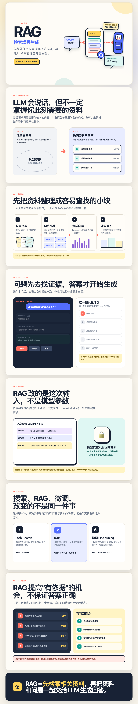

# ELI5+

[English](README_EN.md)

> ELI5 让人听得懂，ELI5+ 让人真正理解。

ELI5+ 是一个面向 AI Agent 的开源 skill。它把复杂主题解释成准确、直观、由浅入深的独立 HTML 页面，帮助非专业读者建立正确的心智模型，而不只是记住一句简化结论。

## 效果与示例



## 它做什么

- 先建立直觉，再解释真实机制；
- 用具体场景、例子和有边界的类比降低理解门槛；
- 用结构图、流程图、对比卡片或必要的动画承载核心关系；
- 主动说明限制、取舍、失败模式和常见误区；
- 输出可离线打开、响应式且自包含的 HTML 文件；
- 在条件允许时进行桌面端和移动端渲染检查。

它追求的是：**大图少字，一节一个重点；少记忆，多直觉。**

## 适用场景

适合解释抽象概念、工作原理、系统流程、容易混淆的概念，以及需要从直觉逐步进入机制的复杂知识。

不适合只要一句话答案的超短总结，也不替代面向专家的论文式技术深挖。

## 安装

### 交给 Agent 安装（推荐）

如果你的 Agent 支持 skills，可以直接把本仓库的 URL 或本地目录交给它，并告诉它：

```text
请安装这个仓库中的 ELI5+ skill。skill 位于 skills/eli5-plus；请按照你当前 Agent 的 skill 安装约定完成安装，并在安装后确认它可以被发现和调用。
```

### 手动安装

将 `skills/eli5-plus` 目录复制到你的 Agent 所使用的 skills 目录。不同 Agent 的目录位置和加载方式可能不同，请以对应 Agent 的约定为准。

例如，在 Codex 中可以从仓库根目录执行：

```bash
mkdir -p ~/.codex/skills
cp -R ./skills/eli5-plus ~/.codex/skills/eli5-plus
```

安装后重新启动或开启一个新任务，使 Agent 重新发现 skills。若目标目录中已有同名 skill，请先自行备份或比较差异。如果 Agent 不支持兼容的 `SKILL.md` 格式，则需要做少量适配。

## 使用

调用语法由具体 Agent 决定。最通用的方式是直接在请求中点名：

```text
使用 ELI5+ 解释 LLM
使用 ELI5+，用图解解释 RAG
```

在支持 `$skill-name` 语法的 Agent 中，也可以显式调用：

```text
$eli5-plus LLM
$eli5-plus 用图解解释 RAG
$eli5-plus 为什么模型蒸馏能让小模型学习大模型？
```

支持自动发现 skills 的 Agent，也可以根据符合适用场景的普通请求自动选择它。最终产物是工作区 `eli5-output/` 子目录中的独立 `.html` 文件，而不是聊天窗口里的一大段 HTML 源码。

## 兼容性

核心行为全部定义在 `skills/eli5-plus/SKILL.md` 中，不依赖特定的 MCP、插件或远程服务。`agents/openai.yaml` 只提供 Codex/OpenAI 客户端可使用的界面元数据；其他 Agent 可以忽略它。

## ELI5 与 ELI5+ 的区别

| | ELI5 | ELI5+ |
|---|---|---|
| 目标 | 快速听懂 | 建立可迁移的心智模型 |
| 内容 | 核心概念和简单类比 | 直觉、机制、例子、边界与取舍 |
| 表达 | 以文字为主 | 视觉优先，必要时使用有意义的动画 |
| 准确性 | 容许较强简化 | 简单但不失真，明确类比边界 |
| 交付 | 通常是短回答 | 完整、独立的 HTML 页面 |

上表中的 ELI5 指 Anthropic 社区插件目录中的官方插件（[来源](https://github.com/anthropics/claude-plugins-community/tree/main/eli5)），本仓库在 [`skills/eli5`](skills/eli5) 收录了其原样副本供对照与离线安装（来源与许可证记录见 [ATTRIBUTION.md](ATTRIBUTION.md)），该副本非本项目维护。

## 设计原则

1. **先直觉，后原理**：先说清它是什么、解决什么问题，再进入真实机制。
2. **具体胜于抽象**：优先使用场景、例子和类比，但不让类比冒充机制。
3. **结构化理解**：突出条件、过程、结果之间的因果关系，而不是堆砌事实。
4. **视觉承担解释**：能用结构、关系、流程或状态表达的内容，不依赖大段正文。
5. **准确性优先**：保留会改变结论的限制、前提、取舍和来源边界。
6. **按主题取舍**：不强迫所有主题套用同一套页面模板。

完整行为约束见 [skills/eli5-plus/SKILL.md](skills/eli5-plus/SKILL.md)。

## 仓库结构

```text
.
├── .github/workflows/validate.yml
├── scripts/validate_skill.py
└── skills/
    ├── eli5                  # 官方社区 eli5 插件原样副本（非本项目维护，见 ATTRIBUTION.md）
    └── eli5-plus
        ├── SKILL.md
        └── agents/openai.yaml    # 可选的 Codex/OpenAI 客户端元数据
```

## 本地校验

```bash
python3 scripts/validate_skill.py
```

校验脚本只使用 Python 标准库，检查 skill 的目录结构、frontmatter、UI 元数据和常见发布污染文件。它不能替代真实主题生成和浏览器视觉检查。

## 贡献

欢迎提交 issue 或 pull request。行为规则的修改最好附带一个真实使用场景，并说明它修复了什么理解或生成问题，避免为了单个页面不断累积通用规则。

## 许可证

[MIT](LICENSE)

本项目为独立开源项目。
